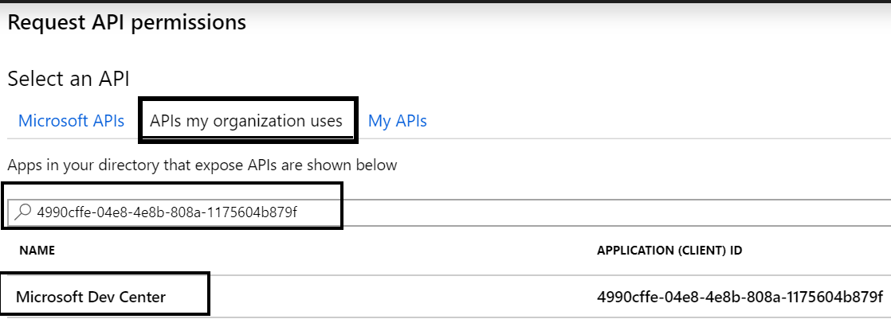
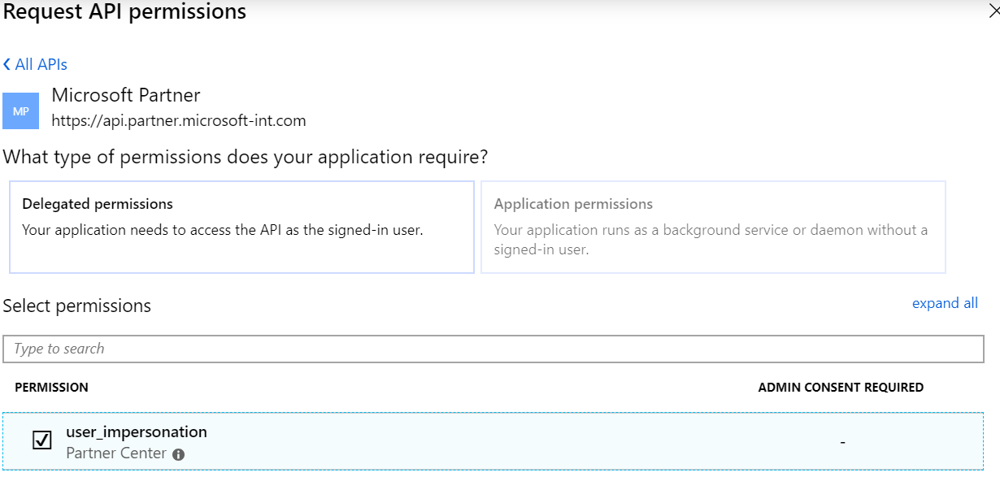
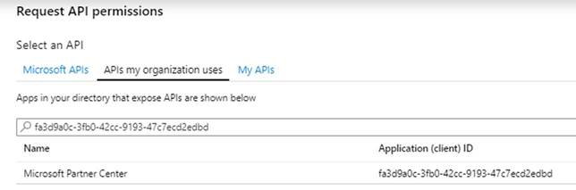
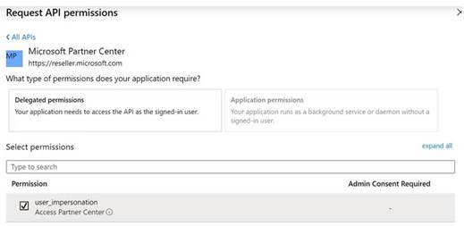

# Partner API authentication

Applies to:

- Partner API

The Partner API utilizes Azure Active Directory (Azure AD) for authentication. When you interact with the Partner API, you must correctly configure an Azure AD application and obtain an access token. You can obtain access tokens for [application and user access](#application-and-user-access) or [application-only access](#application-only-access).

## Application and user access

This method is recommended to set up **application and user access** to the API.

1. Sign in to the [Azure portal](https://portal.azure.com/).
2. Choose the **Azure Active Directory** service.
3. Choose **App registrations**, then choose **New application registration**.
4. Create your new application. For **Application type**, select **Native**. Provide a name and URL, then select **Create**.
5. Choose **API permissions** for the application. On the **Request API permissions** screen, choose **Add a permission**, then choose **APIs my organization uses**
6. Search for the *Microsoft Partner* (*Microsoft Dev Center*) API (`4990cffe-04e8-4e8b-808a-1175604b879f`).

    

7. Set the **Delegated Permissions** to **Partner Center**.

    
    
8. Search for the *Microsoft Partner* (*Microsoft Partner Center*) API (`fa3d9a0c-3fb0-42cc-9193-47c7ecd2edbd`).

    
    
9. Select **Microsoft Partner Center** and check **user_impersonation**.

10. Set the **Delegated Permissions** to **Partner Center**.

    

## Application-only access

This method is recommended for **application-only access** setup to the APIs.

> [!IMPORTANT]
> You must provide the application ID, application key, and directory ID from your Azure AD application.

1. Sign in to the [Azure portal](https://portal.azure.com/).
2. Select the **Azure Active Directory** service.
3. Choose **App registrations**, then select **New application registration**.
4. Create your new application. For **Application type**, choose **Web app/API**. Enter a an application **name** and **URL**. Then choose **Create**.
5. Choose **API permissions** for the application. Choose **Add a permission**, then choose **APIs my organization uses**
6. Search for the *Microsoft Partner* (*Microsoft Dev Center*) API (`4990cffe-04e8-4e8b-808a-1175604b879f`).

    

7. Set the **Delegated Permissions** to **Partner Center**.

    

8. For the application you registered, choose **Properties** and then select **copy the Application ID**.
9. Choose **Settings**, then choose **Certificates & Secrets**. Choose **New Client Secret** and set the **Expiration**  to **Never expires**. Then choose **Save**.
10. On the **Keys** menu, choose **Copy the key value**. Save a copy of this value.

> [!WARNING]
> Be sure to save a copy of the key value for the key you created. You will need to use this key value later to obtain a token.

## Partner consent

In the Azure management portal, select **Enterprise applications**. Search for the application you created in the previous section, and select that application. Select **Permissions** , then select **Grant Admin Consent for Partner Account**.
