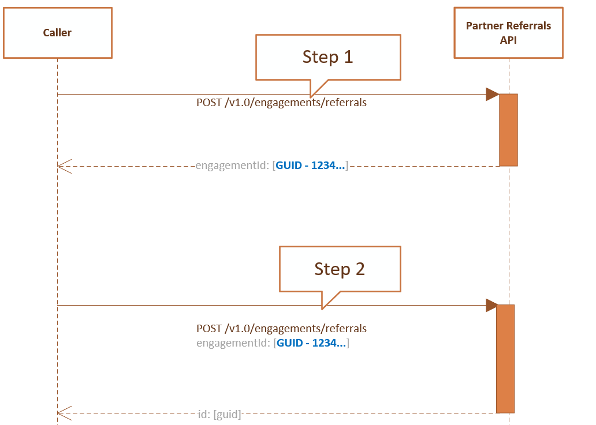

# Create a referral

**Applies To**

- Partner API

This topic explains how to create a referral. There are 2 types of referrals:  

1. Independent: When a referral is visible to one partner.
2. Shared: When a referral is shared across two parties working together. For example, when Microsoft and a partner work together in a co-selling deal.

## Prerequisites

- Credentials as described in [Partner API authentication](api-authentication.md). This scenario supports authentication with App+User credentials.

## Create a shared referral

Creating a referral of shared [ReferralType](referral-resources.md#referraltype) is two step process.

### Step 1:
1. Create a referral with [ReferralType](referral-resources.md#referraltype) set to shared.
2. Copy the **engagementId** from the return response.

[ReferralTarget](referral-resources.md#target) sample for referral
```
"target": [
        {
            "type": "SolutionProfile",
            "id": "SOL-ABC-DEF"
        }
    ]
```

### Step 2:
1. Create another referral for Microsoft.
2. Include the **enagementId** from your referral so they are tied together.

[ReferralTarget](referral-resources.md#target) sample for Microsoft referral
```
"target": [
        {
            "type": "BusinessProfileLocation",
            "id": "msft"
        }
    ]
``` 

  

## REST Request

**Request syntax**

| Method  | Request URI                                                  |
|---------|--------------------------------------------------------------|
| **POST** | https://api.partner.microsoft.com/v1.0/engagements/referrals |

**Request headers**

- See [Partner API REST headers](headers.md) for more information.

**Request body**

This table describes the [Referral](referral-resources.md) properties in the request body for a brand new referral.

| Property            | Type                                                                 | Description                                                                                                          |
|---------------------|----------------------------------------------------------------------|----------------------------------------------------------------------------------------------------------------------|
| Name                | string                                                               | The name of the Referral.                                                                                            |
| ExternalReferenceId | string                                                               | An external identifier for the referral. For example, your own Dynamics 365 lead or opportunity ID.                   |
| Status              | [ReferralStatus](referral-resources.md#referralstatus)               | An [Enum](https://docs.microsoft.com/dotnet/api/system.enum) with values that indicate the referral status.          |
| Substatus           | [ReferralSubstatus](referral-resources.md#referralsubstatus)         | An [Enum](https://docs.microsoft.com/dotnet/api/system.enum) with values that indicate the referral substatus.       |
| StatusReason        | string                                                               | A descriptive message about the status. For example, explain why the referral was lost.                            |
| ReferralType        | [ReferralType](referral-resources.md#referraltype)                   | Represents the referral type. **Required.**                                                                                        |
| Qualification       | [ReferralQualification](referral-resources.md#referralqualification) | Represents the quality of the referral.                                                                              |
| CustomerProfile     | [CustomerProfile](referral-resources.md#customerprofile)             | Customer contact information.  **Required.**                                                                                      |
| Consent             | [Consent](referral-resources.md#consent)                             | Consent flags around sharing information with other organizations and allowing them to contact users.**Required.**               |
| Details             | [ReferralDetails](referral-resources.md#referraldetails)             | Customer details, notes, deal value, currency closing date. **Required.**                                                           |
| Team                | [Member](referral-resources.md#member)                               | Represents users in the organizations that are involved in the partner engagement.                                   |
| InviteContext       | [InviteContext](referral-resources.md#invitecontext)                 | Represents additional information a user can provide when inviting another organization into the partner engagement. |
| Target         | [ReferralTarget](referral-resources.md#target)        | Represents additional information a user can provide when inviting another organization into the partner engagement.  |

**Status & Substatus transition states**

| Status | Allowed status transition | Allowed substatus            |
|--------|---------------------------|------------------------------|
| New    | New, Active, Closed       | Pending, Received            |
| Active | Active, Closed            | Accepted                     |
| Closed | Closed                    | Won, Lost, Declined, Expired |

**Request example**

```http
POST https://api.partner.microsoft.com/v1.0/engagements/referrals HTTP/1.1
Authorization: Bearer <token>
Host: api.partner.microsoft.com
Content-Type: application/json
 
 {
    "name": "Test Cosell Invite_20",
    "status": "New",
    "substatus": "Pending",
    "statusReason": "Customer engagement was a success!",
    "qualification": "SalesQualified",
    "type": "Shared",
    "target": [
        {
            "type": "SolutionProfile",
            "id": "SOL-34104-EBB"
        }
    ],
    "customerProfile": {
        "name": "Contoso Customer Inc",
        "address": {
            "addressLine1": "One Microsoft Way",
            "addressLine2": "34",
            "city": "Redmond",
            "state": "WA",
            "postalCode": "98052",
            "country": "US"
        },
        "size": "10to50employees",
        "team": [
            {
                "contactPreference": {
                    "locale": "en-us",
                    "disableNotifications": false
                },
                "firstName": "Sue",
                "lastName": "Smith",
                "phoneNumber": "1234567890",
                "email": "sue.smith@contoso.com"
            },
            {
                "contactPreference": {
                    "locale": "en-us",
                    "disableNotifications": false
                },
                "firstName": "Joe",
                "lastName": "Hansen",
                "phoneNumber": "4035698759",
                "email": "joe.hansen@contoso.com"
            }
        ],
        "ids": []
    },
    "consent": {
        "consentToToShareInfoWithOthers": true,
        "consentToContact": true
    },
    "details": {
        "notes": "Customer is looking to leverage Dynamics 365 to manage their supply chain. There is also a need to leverage a set of custom apps to enable their business processes.",
        "dealValue": 50000,
        "currency": "USD",
        "closingDateTime": "2018-11-14T00:00:00Z",
        "requirements": {
            "industries": [
                {
                    "id": "Manufacturing"
                }
            ],
            "products": [
                {
                    "id": "Dynamics365Enterprise"
                }
            ],
            "services": [
                {
                    "id": "DeploymentOrMigration"
                }
            ],
            "solutions": [
                {
                    "name": "Dynamics 365 for Field Service",
                    "type": "Category",
                    "id": "Dynamics365forFieldService"
                }
            ]
        }
    },
    "team": [
        {
            "contactPreference": {
                "locale": "en-us",
                "disableNotifications": false
            },
            "firstName": "John",
            "lastName": "Doe",
            "phoneNumber": "1231231234",
            "email": "john.doe@microsoft.com"
        }
    ],
    "inviteContext": {
        "notes": "Hi ABC Partner, hoping you can help this customer. Thanks, John @ Microsoft",
        "invitedBy": {
            "organizationId": "msft"
        }
    }
}
```

## REST Response

If successful, this method returns the populated [Referral](referral-resources.md) resource in the response body.

**Response success and error codes**

Each response comes with an HTTP status code that indicates success or failure and additional debugging information. Use a network trace tool to read this code, error type, and additional parameters. For the full list, see [Error Codes](error-codes.md).

**Response example**

``` http
{
    "id": "4111fffc-f9ee-4d53-bba6-569135228642",
    "engagementId": "37ef26aa-1d15-4533-9f93-a69bd33ab1e5",
    "organizationId": "7d23e5ca-19dc-4eaa-aac8-5e6b559f0d1d",
    "organizationName": "Contoso Company",
    "name": "Test Cosell Invite_20",
    "externalReferenceId": null,
    "createdDateTime": "2019-02-23T02:05:23.2931817Z",
    "updatedDateTime": "2019-02-23T02:05:23.2931817Z",
    "expirationDateTime": null,
    "status": "Active",
    "substatus": "Accepted",
    "statusReason": "Customer engagement was a success!",
    "qualification": "SalesQualified",
    "type": "Shared",
    "eTag": "\"00006d10-0000-0000-0000-5c70aa630000\"",
    "target": [
        {
            "type": "SolutionProfile",
            "id": "SOL-34104-EBB"
        }
    ],
    "customerProfile": {
        "name": "Contoso Customer Inc",
        "address": {
            "addressLine1": "One Microsoft Way",
            "addressLine2": "34",
            "city": "Redmond",
            "state": "WA",
            "postalCode": "98052",
            "country": "US"
        },
        "size": "10to50employees",
        "team": [
            {
                "contactPreference": {
                    "locale": "en-us",
                    "disableNotifications": false
                },
                "firstName": "Sue",
                "lastName": "Smith",
                "phoneNumber": "1234567890",
                "email": "sue.smith@contoso.com"
            },
            {
                "contactPreference": {
                    "locale": "en-us",
                    "disableNotifications": false
                },
                "firstName": "Joe",
                "lastName": "Hansen",
                "phoneNumber": "4035698759",
                "email": "joe.hansen@contoso.com"
            }
        ],
        "ids": []
    },
    "consent": {
        "consentToToShareInfoWithOthers": true,
        "consentToContact": true
    },
    "details": {
        "notes": "Customer is looking to leverage Dynamics 365 to manage their supply chain. There is also a need to leverage a set of custom apps to enable their business processes.",
        "dealValue": 50000,
        "currency": "USD",
        "requirements": {
            "industries": [
                {
                    "id": "Manufacturing"
                }
            ],
            "products": [
                {
                    "id": "Dynamics365Enterprise"
                }
            ],
            "services": [
                {
                    "id": "DeploymentOrMigration"
                }
            ],
            "solutions": [
                {
                    "name": "Dynamics 365 for Field Service",
                    "type": "Category",
                    "id": "Dynamics365forFieldService"
                }
            ]
        }
    },
    "team": [
        {
            "contactPreference": {
                "locale": "en-us",
                "disableNotifications": false
            },
            "firstName": "John",
            "lastName": "Doe",
            "phoneNumber": "1231231234",
            "email": "john.doe@microsoft.com"
        }
    ],
    "inviteContext": {
        "notes": "Hi ABC Partner, hoping you can help this customer. Thanks, John @ Microsoft",
        "invitedBy": {
            "organizationId": "msft"
        }
    },
    "links": {
        "relatedReferrals": {
            "uri": "https://api.partner.microsoft.com/v1.0/engagments/referrals?$filter=engagementId eq '37ef26aa-1d15-4533-9f93-a69bd33ab1e5'",
            "method": "GET"
        },
        "self": {
            "uri": "https://api.partner.microsoft.com/v1.0/engagments/referrals/4111fffc-f9ee-4d53-bba6-569135228642",
            "method": "GET"
        }
    }
}
```
