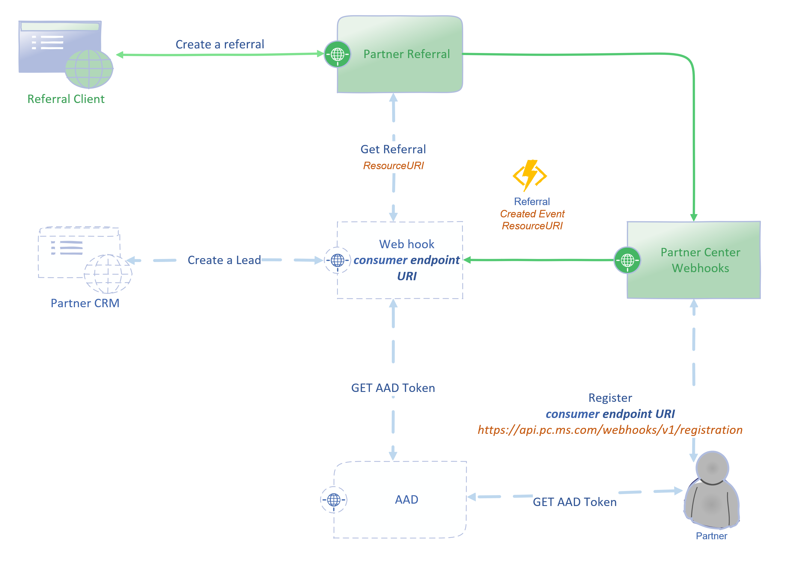

# Referral Connectors

This article explains how **Referrals Connectors** work.

# Prerequisites

- You need to be an admin on your [flow.microsoft.com](https://flow.microsoft.com).
- You need to be an admin on your Microsoft Dynamics CRM Online instance.
- You need an **Application Id** and **secret** to access Partner API .(See [Partner authentication](api-authentication.md) for initial setup.)
- [Partner Center Webhook](https://docs.microsoft.com/en-us/partner-center/develop/partner-center-webhook-events) subscription to [Referral Created](https://docs.microsoft.com/en-us/partner-center/develop/partner-center-webhook-events#referral-created-event) and [Referral Updated](https://docs.microsoft.com/en-us/partner-center/develop/partner-center-webhook-events#referral-updated-event)

## Connectors

Connectors provide an easy way to synchronize referrals from **Partner Center** to **Partner's Dynamics CRM Online**.

There are two reference connectors
- Synchronize referral to Microsoft Dynamics CRM lead.
- Synchronize Microsoft Dynamics CRM lead to referral.
 

## How it works

Here is the flow of how referrals are synchronized to Partner's CRM.

Triggers for the connectors are built into the Microsoft Flow documents.
- To synchronize referral to lead
    1. Gets a token to connect to https://api.partner.microsoft.com/v1.0/engagements/referrals.
    2. Gets the referral which triggered the connector using https://api.partner.microsoft.com/v1.0/engagements/referrals/{id}.
    3. Connects to Microsoft Dynamics CRM.
    4. Creates a new lead or updates existing lead with the latest information on the referral.
    5. Updates the referral with the latest updates from the CRM lead.

- To synchronize lead from Dynamics CRM to referral 
    1. Connects to Microsoft Dynamics CRM.
    2. Gets the lead from Microsoft Dynamics CRM.
    3. Reads the referral id from the subject field of the lead.
    4. Gets a token to connect to https://api.partner.microsoft.com/v1.0/engagements/referrals.
    5. Gets the referral referral id  using  https://api.partner.microsoft.com/v1.0/engagements/referrals/{id}.
    6. Updates the referral with the latest updates from the CRM lead.
